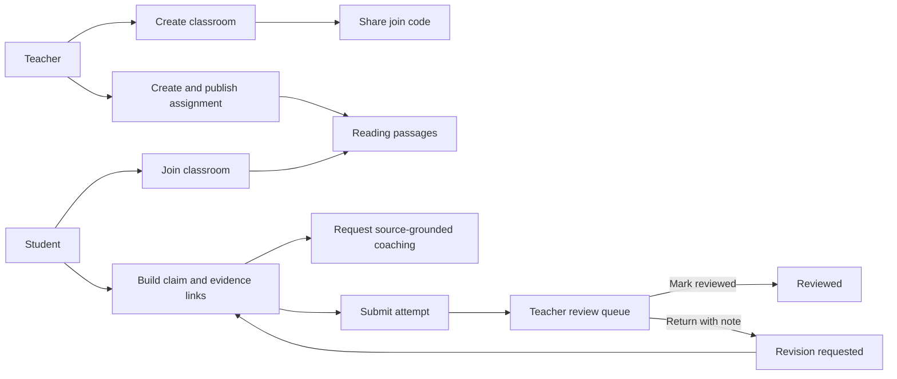
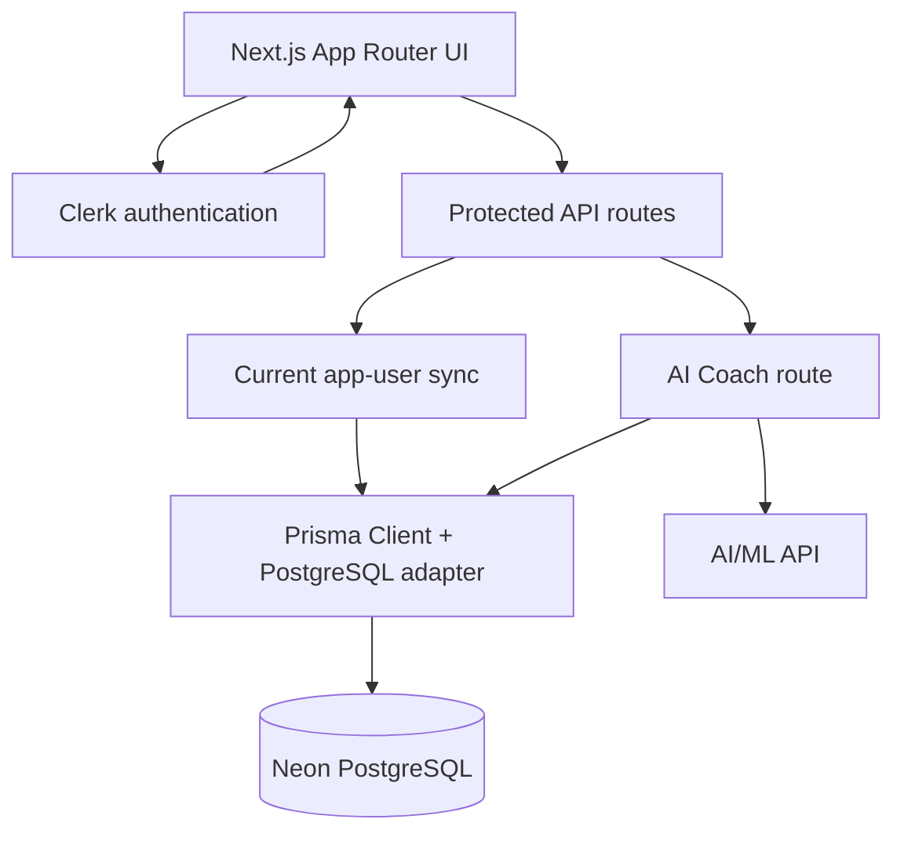
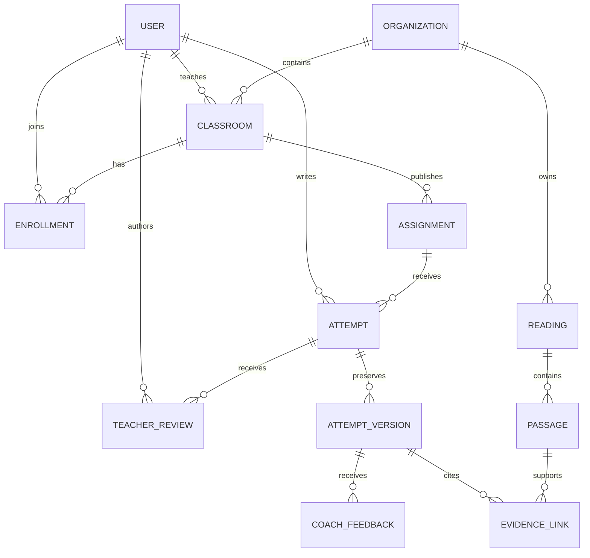
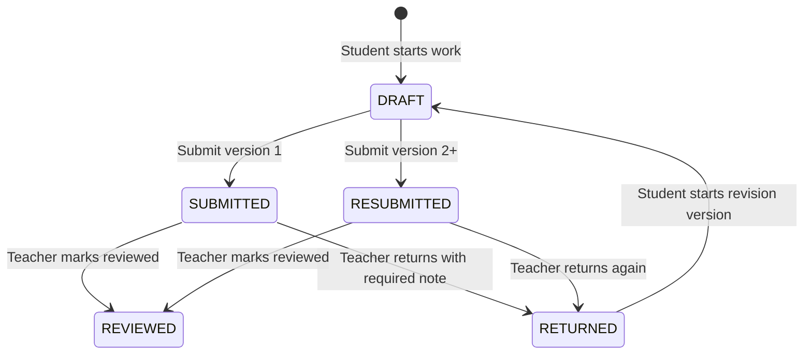
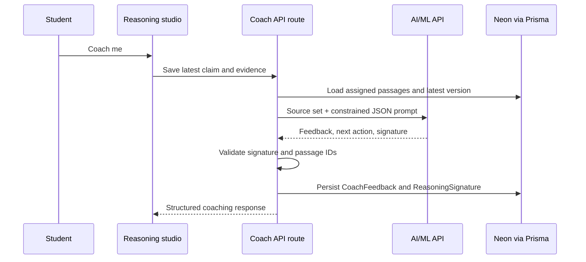

# Citation Gym

> A source-grounded reasoning workspace where students build evidence-backed arguments and teachers review the full reasoning trail.

Citation Gym helps students move beyond dropping quotations into an answer. Students select passages, make a claim, explain the connection, receive bounded AI coaching, submit their work, and revise it when a teacher returns it. Teachers create classrooms and assignments, review submissions, return actionable feedback, and see recurring reasoning patterns.

## Highlights

- Role-aware Teacher and Student workspaces with Clerk authentication.
- Classroom creation, generated join codes, and student enrollment.
- Teacher-created source sets split into selectable passages.
- Evidence-to-claim reasoning studio with saved drafts and immutable revision versions.
- AI/ML API coaching constrained to the assigned source set.
- Teacher review workflow: mark reviewed or return for revision with a required note.
- Prisma + Neon PostgreSQL persistence, audit events, and Vercel-ready client generation.

## Product flow



## Architecture



## Data model



## Attempt lifecycle



## Tech stack

| Area | Technology |
| --- | --- |
| Framework | Next.js 16, React 19, TypeScript |
| UI | Tailwind CSS 4, shadcn/ui, Base UI, Tabler Icons |
| Authentication | Clerk |
| Database | Neon PostgreSQL |
| ORM | Prisma 7 with `@prisma/adapter-pg` |
| AI coaching | AI/ML API-compatible chat-completions endpoint |
| Themes | `next-themes` |

## Local setup

### Prerequisites

- Node.js 20.9 or later
- A Neon PostgreSQL database
- A Clerk application
- An AI/ML API key and compatible model name for coaching

### 1. Install dependencies

```bash
npm install
```

`postinstall` runs `prisma generate`, creating the ignored Prisma client output at `app/generated/prisma`.

### 2. Configure environment variables

Create `.env.local`:

```bash
DATABASE_URL="postgresql://..."

NEXT_PUBLIC_CLERK_PUBLISHABLE_KEY="pk_..."
CLERK_SECRET_KEY="sk_..."

AIMLAPI_KEY="..."
AIMLAPI_MODEL="..."
# Optional; defaults to https://api.aimlapi.com/v1
AIMLAPI_BASE_URL="https://api.aimlapi.com/v1"
```

Never expose `CLERK_SECRET_KEY`, `DATABASE_URL`, or `AIMLAPI_KEY` to the browser.

### 3. Apply database migrations

```bash
npm run prisma:migrate -- --name your-migration-name
```

For an existing deployed database, use:

```bash
npm run prisma:deploy
```

### 4. Start development

```bash
npm run dev
```

Open [http://localhost:3000](http://localhost:3000).

## Scripts

```bash
npm run dev              # Start Next.js development server
npm run build            # Production build
npm run start            # Start production server
npm run typecheck        # Run TypeScript validation
npm run lint             # Run ESLint
npm run format           # Format TypeScript and TSX files
npm run prisma:generate  # Regenerate Prisma Client
npm run prisma:migrate   # Create/apply development migration
npm run prisma:deploy    # Apply committed migrations
npm run prisma:studio    # Open Prisma Studio
```

## Roles and permissions

| Capability | Student | Teacher |
| --- | --- | --- |
| Join a class by code | Yes | No |
| Create classroom / assignment | No | Yes |
| Start, save, and submit own attempt | Yes | No |
| Request AI coaching for own work | Yes, when enabled | No |
| Review classroom submissions | No | Yes |
| Return work with required note | No | Yes |
| Mark work reviewed | No | Yes |
| Manage organization and AI controls | No | Planned teacher settings surface |

All route handlers verify the authenticated user and enforce ownership through the classroom, assignment, or attempt relationship.

## Student workflow

1. Sign up or sign in, then select the Student role.
2. Join a classroom with the code shared by the teacher.
3. Open a published assignment and start the reasoning studio.
4. Select relevant passages, write a claim, and explain how evidence supports it.
5. Save a draft and optionally request AI coaching.
6. Review and submit the attempt.
7. If returned, read the latest teacher note, start a new revision version, revise, and resubmit.

## Teacher workflow

1. Sign up or sign in, then select the Teacher role.
2. Create a classroom and share its join code.
3. Create a published assignment with a title, argument prompt, and source text.
4. Open the assignment queue to inspect each student attempt.
5. Mark a submission reviewed, or return it with a required actionable note.
6. Review resubmitted versions while retaining the original reasoning trail.

## AI coaching contract

The coach receives only the assigned passages, the student claim, and selected evidence explanations. It is instructed to avoid rewriting the student’s answer or inventing outside facts.



Recognized signatures include unsupported inference, evidence without explanation, overbroad claims, ignored counterevidence, and source misreading. Invalid provider responses are rejected rather than saved as trusted feedback.

## Deployment on Vercel

1. Import the Git repository into Vercel.
2. Add the same environment variables from `.env.local` in **Project Settings → Environment Variables**.
3. Deploy. The `postinstall` script runs `prisma generate` on Vercel, so `app/generated/prisma` should remain ignored and must not be committed.
4. Apply production migrations with `npm run prisma:deploy` from a controlled deployment step or CI workflow.

For production, use a Neon pooled connection string appropriate for serverless workloads and keep secrets scoped to the required Vercel environments.

## Project structure

```text
app/
  (platform)/app/       # Authenticated teacher, student, review, and settings routes
  api/v1/               # Protected classroom, assignment, attempt, review, and coach APIs
  generated/prisma/     # Generated locally/on Vercel; intentionally ignored
components/             # Application UI and shadcn/ui components
lib/                    # Prisma singleton, app-user sync, workspace and API helpers
prisma/                 # Schema and committed database migrations
```

## Verification checklist

Before sharing or deploying, verify:

- [ ] `npm run typecheck` succeeds.
- [ ] Teacher can create a class and publish an assignment.
- [ ] Student can join using the class code.
- [ ] Student can save, coach, and submit an attempt.
- [ ] Teacher can review or return an attempt with a note.
- [ ] Student can create a revision and resubmit it.
- [ ] Vercel environment variables are configured.
- [ ] Prisma migrations have been applied to the target Neon database.

## License

This repository does not currently declare a license. Add one before distributing the project publicly.
