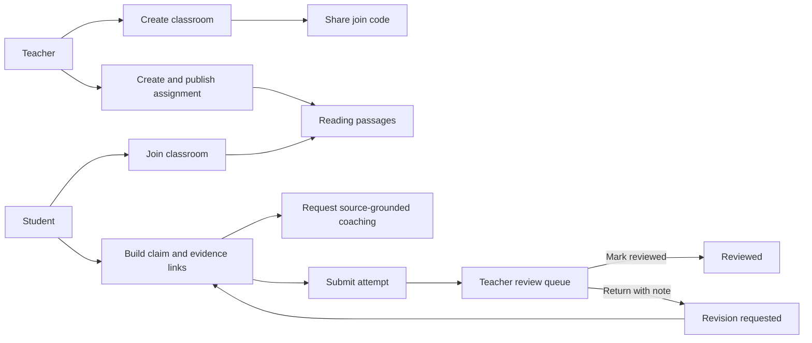
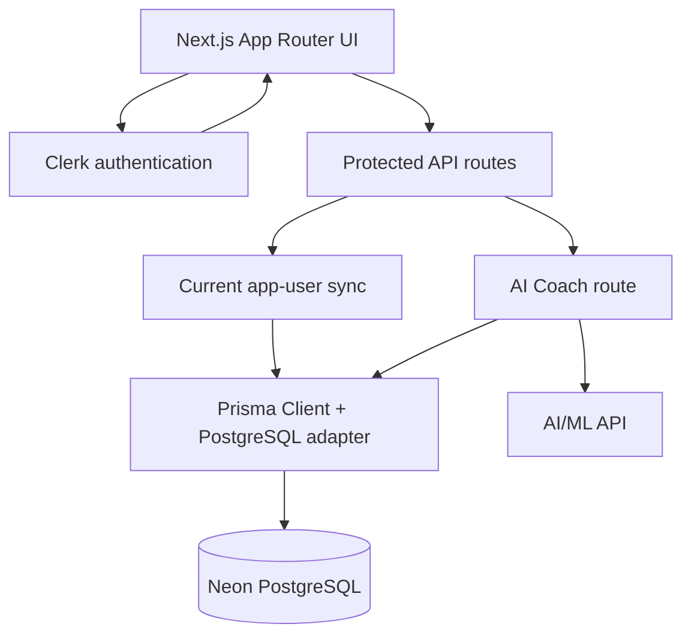
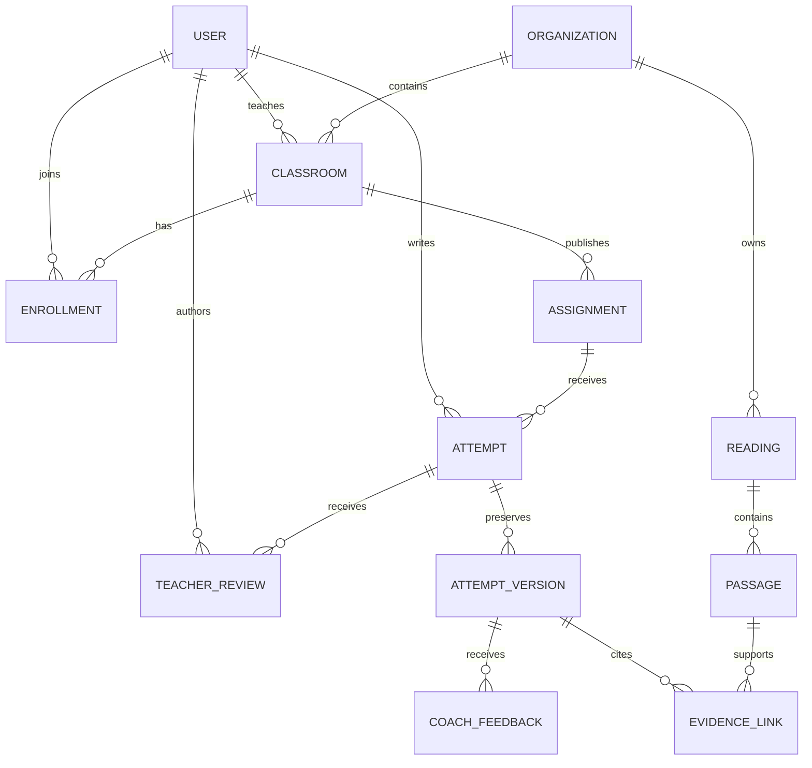
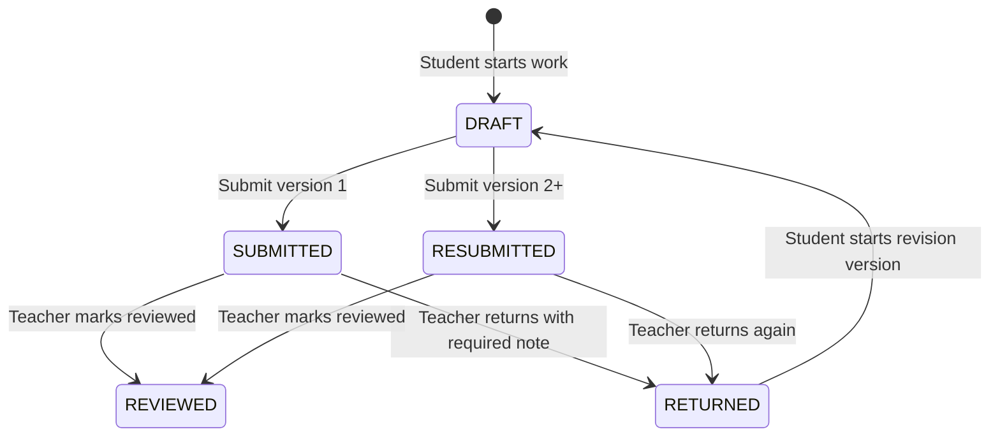
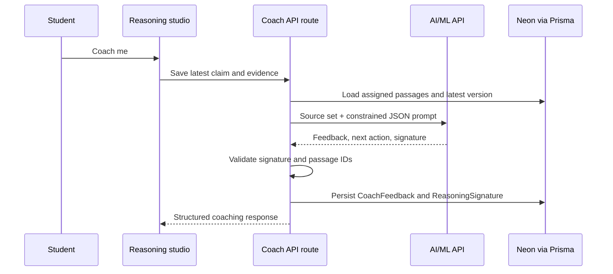

# Citation Gym 🏋️‍♀️

> **Train the reasoning behind the citation.**
>
> An AI-assisted learning workspace where students build source-grounded arguments and teachers see the complete reasoning trail—not just the final answer.


Citation Gym helps students move beyond dropping quotations into an answer. They select passages, make a claim, explain the connection, receive bounded AI coaching, submit work, and revise after teacher feedback. Teachers create classrooms and assignments, review the complete trail, return actionable notes, and identify recurring reasoning patterns.

## Table of contents

- [Why Citation Gym](#why-citation-gym)
- [Features](#features)
- [Product flow](#product-flow)
- [Architecture](#architecture)
- [Data model](#data-model)
- [Attempt lifecycle](#attempt-lifecycle)
- [Tech stack](#tech-stack)
- [Local setup](#local-setup)
- [Roles and permissions](#roles-and-permissions)
- [AI coaching contract](#ai-coaching-contract)
- [Deployment on Vercel](#deployment-on-vercel)
- [Key technical decisions](#key-technical-decisions)
- [Known limitations and roadmap](#known-limitations-and-roadmap)

## Why Citation Gym

Most writing tools evaluate the finished paragraph. Citation Gym makes the **reasoning process** visible: the claim, the selected evidence, the student’s explanation, the AI coach’s bounded prompt, and the revision history are all first-class data.

That creates two complementary experiences:

- **Students** get a coach that points to the next reasoning move instead of silently supplying an answer.
- **Teachers** can inspect exactly how a student connected evidence to a claim, return work with a focused note, and preserve the before/after revision trail.

## Features

- Role-aware Teacher and Student workspaces with Clerk authentication.
- Classroom creation, generated join codes, and student enrollment.
- Teacher-created source sets split into selectable passages.
- Evidence-to-claim reasoning studio with saved drafts and immutable revision versions.
- AI/ML API coaching constrained to the assigned source set.
- Teacher review workflow: mark reviewed or return for revision with a required note.
- Prisma + Neon PostgreSQL persistence, audit events, and Vercel-ready client generation.

### What makes the AI different

The coach is intentionally constrained. It receives the assignment’s passages, the student’s claim, and their chosen evidence explanations—not open-web context or another student’s work. The response is normalized into structured feedback, a specific next action, and (when applicable) a reusable reasoning signature for teacher insight.

## Product flow



## Architecture



## Data model



## Attempt lifecycle



## Tech stack

| Area | Technology |
| --- | --- |
| Framework | Next.js 16, React 19, TypeScript |
| UI | Tailwind CSS 4, shadcn/ui, Base UI, Tabler Icons |
| Authentication | Clerk |
| Database | Neon PostgreSQL |
| ORM | Prisma 7 with `@prisma/adapter-pg` |
| AI coaching | AI/ML API-compatible chat-completions endpoint |
| Themes | `next-themes` |

## Feature map

| Surface | Student experience | Teacher experience |
| --- | --- | --- |
| Classrooms | Join with a code and view enrolled classes | Create classes and share generated codes |
| Assignments | Read source passages and open work | Create and publish prompt + source set |
| Reasoning | Save claims, evidence connections, drafts, and revisions | Inspect each attempt and its linked evidence |
| Feedback | Receive AI coaching and latest return note | Mark reviewed or return work with a required note |
| Persistence | Resume the latest attempt version | See submission status and review history |

## Local setup

### Prerequisites

- Node.js 20.9 or later
- A Neon PostgreSQL database
- A Clerk application
- An AI/ML API key and compatible model name for coaching

### 1. Install dependencies

```bash
npm install
```

`postinstall` runs `prisma generate`, creating the ignored Prisma client output at `app/generated/prisma`.

### 2. Configure environment variables

Create `.env.local`:

```bash
DATABASE_URL="postgresql://..."

NEXT_PUBLIC_CLERK_PUBLISHABLE_KEY="pk_..."
CLERK_SECRET_KEY="sk_..."

AIMLAPI_KEY="..."
AIMLAPI_MODEL="..."
# Optional; defaults to https://api.aimlapi.com/v1
AIMLAPI_BASE_URL="https://api.aimlapi.com/v1"
```

Never expose `CLERK_SECRET_KEY`, `DATABASE_URL`, or `AIMLAPI_KEY` to the browser.

### 3. Apply database migrations

```bash
npm run prisma:migrate -- --name your-migration-name
```

For an existing deployed database, use:

```bash
npm run prisma:deploy
```

### 4. Start development

```bash
npm run dev
```

Open [http://localhost:3000](http://localhost:3000).

## Scripts

```bash
npm run dev              # Start Next.js development server
npm run build            # Production build
npm run start            # Start production server
npm run typecheck        # Run TypeScript validation
npm run lint             # Run ESLint
npm run format           # Format TypeScript and TSX files
npm run prisma:generate  # Regenerate Prisma Client
npm run prisma:migrate   # Create/apply development migration
npm run prisma:deploy    # Apply committed migrations
npm run prisma:studio    # Open Prisma Studio
```

## Roles and permissions

| Capability | Student | Teacher |
| --- | --- | --- |
| Join a class by code | Yes | No |
| Create classroom / assignment | No | Yes |
| Start, save, and submit own attempt | Yes | No |
| Request AI coaching for own work | Yes, when enabled | No |
| Review classroom submissions | No | Yes |
| Return work with required note | No | Yes |
| Mark work reviewed | No | Yes |
| Manage organization and AI controls | No | Planned teacher settings surface |

All route handlers verify the authenticated user and enforce ownership through the classroom, assignment, or attempt relationship.

## Student workflow

1. Sign up or sign in, then select the Student role.
2. Join a classroom with the code shared by the teacher.
3. Open a published assignment and start the reasoning studio.
4. Select relevant passages, write a claim, and explain how evidence supports it.
5. Save a draft and optionally request AI coaching.
6. Review and submit the attempt.
7. If returned, read the latest teacher note, start a new revision version, revise, and resubmit.

## Teacher workflow

1. Sign up or sign in, then select the Teacher role.
2. Create a classroom and share its join code.
3. Create a published assignment with a title, argument prompt, and source text.
4. Open the assignment queue to inspect each student attempt.
5. Mark a submission reviewed, or return it with a required actionable note.
6. Review resubmitted versions while retaining the original reasoning trail.

## AI coaching contract

The coach receives only the assigned passages, the student claim, and selected evidence explanations. It is instructed to avoid rewriting the student’s answer or inventing outside facts.



Recognized signatures include unsupported inference, evidence without explanation, overbroad claims, ignored counterevidence, and source misreading. Invalid provider responses are rejected rather than saved as trusted feedback.

## Deployment on Vercel

1. Import the Git repository into Vercel.
2. Add the same environment variables from `.env.local` in **Project Settings → Environment Variables**.
3. Deploy. The `postinstall` script runs `prisma generate` on Vercel, so `app/generated/prisma` should remain ignored and must not be committed.
4. Apply production migrations with `npm run prisma:deploy` from a controlled deployment step or CI workflow.

For production, use a Neon pooled connection string appropriate for serverless workloads and keep secrets scoped to the required Vercel environments.

## Key technical decisions

### Prisma Client is generated at build time

Prisma 7 generates the client into `app/generated/prisma`, which is intentionally ignored by Git. The `postinstall` script runs `prisma generate` locally and on Vercel so every build uses a client matching the committed schema and migrations.

### Evidence links are separate from the claim

An `AttemptVersion` stores the claim and reflection, while each `EvidenceLink` records a specific passage, explanation, and position. This makes the evidence graph inspectable and gives the AI coach grounded context rather than a single opaque answer field.

### Revision history is immutable

When a teacher returns work, starting a revision clones the latest attempt version. The original submitted work remains available for teacher review, while the student edits and resubmits a new version.

### AI feedback is bounded and auditable

The coach route validates provider output before persistence, filters passage references to the assignment’s source set, and records audit events. The provider can be swapped later because the application uses an OpenAI-compatible chat-completions boundary.

## Known limitations and roadmap

### Current limitations

- Organization and AI settings routes exist but their dynamic settings UI is still planned.
- Teacher insights are built around saved reasoning signatures; richer aggregate visualizations are a natural next step.
- AI coaching is a structured single-call workflow today, not a multi-agent orchestration system.
- There is no automated test suite yet; validation currently relies on type checks plus end-to-end manual role testing.

### Next slices

- [ ] Dynamic Profile, Organization, and AI-control settings.
- [ ] Teacher insight dashboard with signature trends across a class.
- [ ] Rubric-aware feedback and teacher-configured criteria.
- [ ] Math-aware verification tools for algebra and calculation assignments.
- [ ] Evaluation fixtures for AI feedback quality and source grounding.
- [ ] Controlled multi-step/LangGraph coaching workflow, if the product needs deeper tool use.

## Project structure

```text
app/
  (platform)/app/       # Authenticated teacher, student, review, and settings routes
  api/v1/               # Protected classroom, assignment, attempt, review, and coach APIs
  generated/prisma/     # Generated locally/on Vercel; intentionally ignored
components/             # Application UI and shadcn/ui components
lib/                    # Prisma singleton, app-user sync, workspace and API helpers
prisma/                 # Schema and committed database migrations
```

## Verification checklist

Before sharing or deploying, verify:

- [ ] `npm run typecheck` succeeds.
- [ ] Teacher can create a class and publish an assignment.
- [ ] Student can join using the class code.
- [ ] Student can save, coach, and submit an attempt.
- [ ] Teacher can review or return an attempt with a note.
- [ ] Student can create a revision and resubmit it.
- [ ] Vercel environment variables are configured.
- [ ] Prisma migrations have been applied to the target Neon database.

## License

This project is open-source and available under the [MIT License](https://github.com/Talha-Tahir2001/citation-gym/blob/main/LICENSE).
